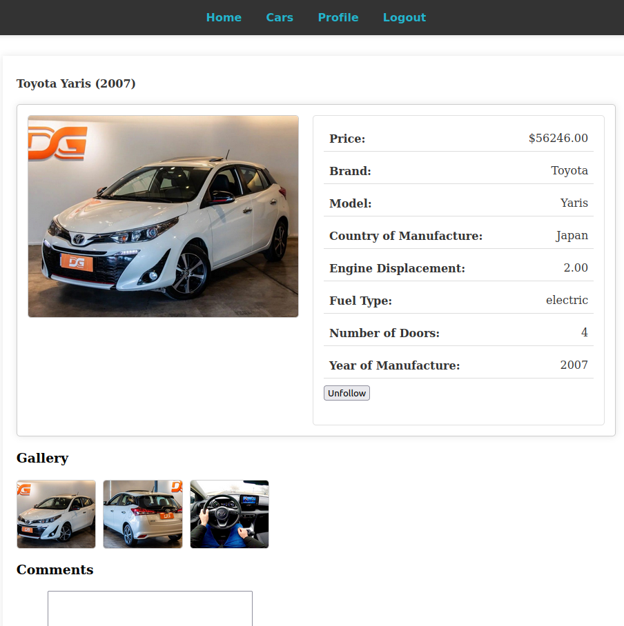
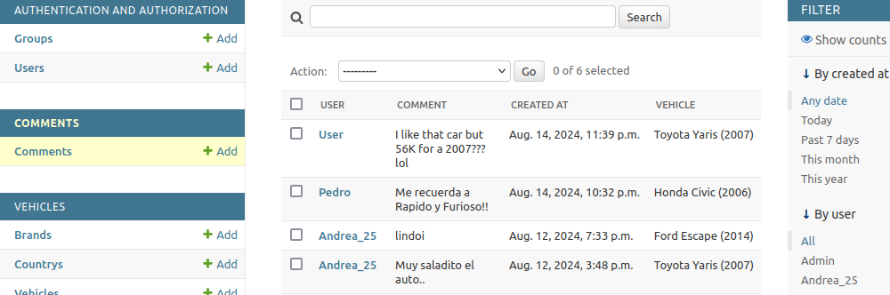
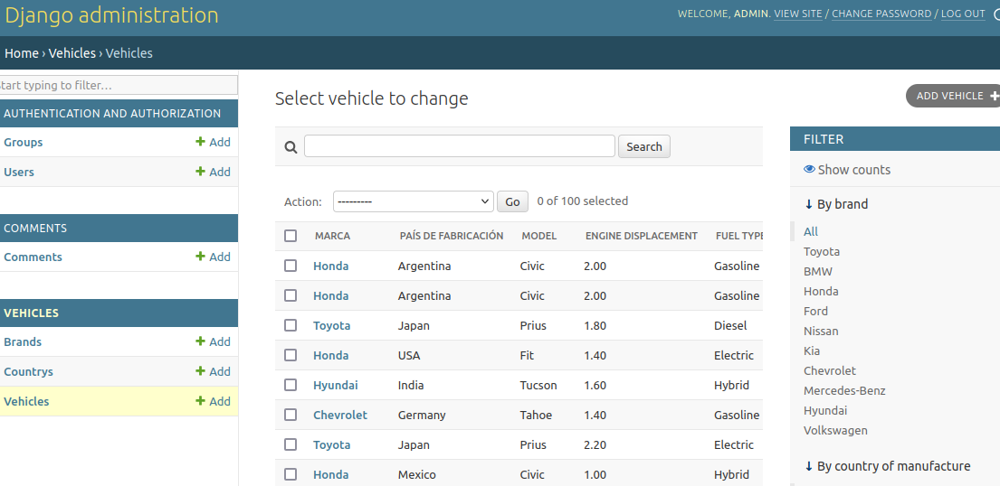

<<<<<<< HEAD
# Concesionario Django Project

Bienvenido al **Proyecto de consecionario en Django**! Esta aplicación web, desarrollada como parte de la carrera de desarrollo de software de ITEC Río Cuarto Argentina, está diseñado para manejar una consesionaria. El proyecto explora todo el potencial de Django usando la arquitectura Model-Template-View (MTV).

**Este proyecto está en proceso y no está hecho para su uso en produción.** Sirve como una asignación de curso, con el principal objetivo de demostrar las carácteristicas de Django en un entorno controlado.




## Tabla de contenidos

- [Carácteristicas](#Carácteristicas)
- [Instalación](#instalación)
- [Uso](#uso)
- [Créditos](#créditos)

## Carácteristicas

- **Estructura de la aplicación**: El proyecto está organizado en 4 aplicaciones principales en Django: `Vehicles`, `Comments`, `Users`, y `Media`, cada uno manejando distintos aspectos de la aplicación.
- **Sin JavaScript**: El proyecto está enteramente hecho usando la arquitectura Model-Template-View de Django y con Python y HTML, sin nada de JavaScript.
- **Manejo de imágenes**: Las imágenes están almaceneadas con nombres de archivos unicos generados usando UUIDs para evitar conflictos y asegurar consistencia.
- **Capacidades de administrador**: Los usuarios administradores tienen control absoluto de gestión, incluyendo subir y administrar imagénes através tanto de la interfaz frontend y el backend de administrador de Django.
- **Roles de usuario**: La aplicación posee diferentes roles de usuarios, cada uno con permisos variantes.
- **Registro de usuarios y aunteticación**: Proceso seguro de reigstro, inicio y cierre de sesión.
- **Administración de vehiculos**: Los administradores puede añadir, actualizar y borrar vehiculos, y subir imagénes.
- **Sistema de comentarios**: Los usuarios pueden dejar comentarios en los vehiculos con los administradores y moderadores siendo capaces de administrar estos comentarios.
- **Seguimiento de vehiculos**: Los usuarios pueden seguir vehiculos en específico y verlos en sus perfiles.
- **Filtrado Dinamico**: En el panel de administración, los vehiculos pueden ser filtrados por varios criterios tales como, marca, precio, y año de manufactura.
- **Context Processors**: Unos Custom context processors inyectan los estados de usuario en templates.


## Instalación

### Prerrequisitos

Antes de empezar, asegurese de que cumple con los siguientes requerimientos:

- Python 3.10 o superior
- Django 5.1 o superior
- Una herramienta para entornos virtuales como `venv` o `virtualenv`
- Git para control de versiones

### Pasos

1. **Clonar el repositorio**

    ```bash
    git clone https://github.com/Did11/saez-django-concesionario.git
    cd saez-django-concesionario
    ```

2. **Crear un entorno virtual**

    ```bash
    python3 -m venv entorno
    source entorno/bin/activate  # En Windows use `entorno\Scripts\activate`
    ```

3. **Instalar Dependencias**

    ```bash
    pip install -r requirements.txt
    ```

4. **Activa el servidor de desarrollo**

    ```bash
    python3 concesionario/manage.py runserver
    ```

El proyecto estará disponible en `http://127.0.0.1:8000`.

*Nota: El proyecto viene con una base de datos pre-poblada, incluyendo usuarios administradores y datos de demostración, así que no hace falta añadir un nuevo superuser o aplicar migraciones.*


## Uso

- **Panel de administrador**: Acceda al panel de administrador en `http://127.0.0.1:8000/admin/` usando credenciales de superuser. Desde aquí, puede administrar vehiculos, imágenes, comentarios, y roles de usuario con total control.
- **Listado de vehiculos**: Explora la comprensible lista de vehiculos al visitar la sección de autos en `http://127.0.0.1:8000/vehicles/`. Los usuarios pueden filtrar los vehiculos por distintos críterios, ver información detallada, e interactuar con carácteristicas tales como comentar y seguir vehiculos.
- **Perfil de usuario**: Tras iniciar sesión, los usuarios pueden acceder a su perfil en `http://127.0.0.1:8000/profile/` para administrar los vehiculos seguidos, editar sus comentarios, y actualizar los detalles de sus cuentas.
**Shell de Django**: Puedes acceder a la shell de Django para un testeo y manejo avazados usando el siguiente comando en tu terminal:

    ```bash
    python3 concesionario/manage.py shell
    ```

    Desde aquí, se puede interactuar con tus modelos de Django y realizar consultas a la base de datos.

## Documentación de la API

Este proyecto incluye una API REST que le permite a aplicaciones externas acceder y gestionar datos del consecionario, incluyendo vehiculos, usuarios, comentarios, y más. La API está documentada con Swagger, el cual provee una interfaz de usuario interactiva para explorar y probar cada endpoint.

### Acediendo a la API

- **API Root**: La API es accessible en `http://127.0.0.1:8000/api/`.
- **Authenticación**: la mayoría de endpoints requieren authenticación via token. para obtener un token, use el endpoit `/token-auth/` e incluyalo en los headers para peticiones auntenticadas.
- **Documentación de Swagger**: La documentación completa de la API está disponible en `http://127.0.0.1:8000/swagger/`. Swagger ofrece una interfaz para probar cad endpoint, ver detalles de input/output, y explorar opciones de parametros.

### Endpoints clave de la API

| Endpoint                       | Método | Descripción                                        |
|--------------------------------|--------|----------------------------------------------------|
| `/api/brands/`                 | GET    | Devuelve una lista con todas las marcas.           |
| `/api/vehicles/`               | GET    | Devuelve una lista de autos con distintos criterios|
| `/api/users/`                  | GET    | Devuelve una lista de usuarios (se requiere acceso de administrador).  |
| `/api/vehicles/<id>/comments/` | GET    | Devuelve comentarios de un vehículo en especifico.          |
| `/api/clients/create/`         | POST   | Crea un nuevo cliente (se requiere acceso de administrador).       |
| `/api/clients/`                | GET    | Devuelve una lista de clientes (se requiere acceso de administrador).|
| `/api/token-auth/`             | POST   | Se obtiene un toke de auntenticación API requests.   |

### Ejemplo: Usando la API con Postman

1. **Autenticar**: Use el endpoint `/api/token-auth/` para conseguir un token. envie un POST request con su nombre de usuario y contraseña en el cuerpo.
2. **Set the Token**: Copie el token de la respuesta, luego incluyalo en el header de autorización para las peticiones subecuentes: `Authorization: Token <tu_token>`.
3. **Explore los Endpoints**: Use Postman o Swagger para interactuar con los varios endpoints, asegurandose de incluir el token para los endpoints que requieran auntenticación.

### Funcionalidades disponibles de la API

La API ofrece varias carácteristicas para el manejo de datos de un consecionario:
- **Listado de vehiculos**: Devuelve y filtra un listado de vehiculos con detalles tales como marca, modelo, año, y más.
- **Comentar**: Accede a comentarios en vehiculos especifico y gestiona dichos comentarios (con privilegios de administrador).
- **Gestión de clientes**: Los usuarios administrador pueden crear y listar clientes para el consecionario.
- **Perfiles de usuario**: Devuelve información de perfil de usuario (se requiere acesso de administrador).

Para una documentación completa de los endpoint, incluyendo parametros y respuestas de ejemplo, vease la**Documentación de Swagger** en `http://127.0.0.1:8000/swagger/`.


## Créditos

- **Desarrollado por**: Saez, Marcos. 

## Licencia

This project is licensed under the MIT License. See the `LICENSE` file for details.


=======
# efi_ing_soft_marcos
>>>>>>> 5e5b976928a40ce442b4147cd2ede915dbbbb2e3
